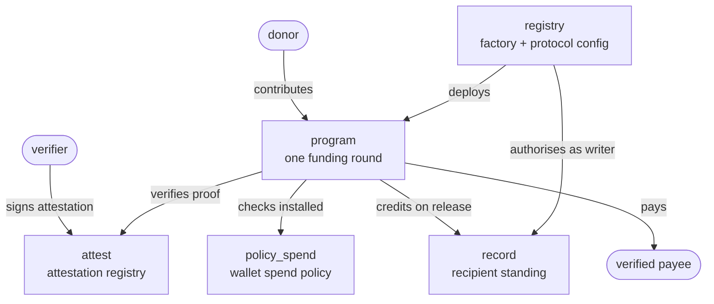

# Milepost

*A milepost marks how far along the road you have come.*

Conditional disbursement infrastructure on Stellar. A funder commits money to a
programme; recipients receive it in tranches that unlock only when a trusted
verifier attests that a condition was met; and each release leaves behind a
portable record the next funder can underwrite against.

Money moves at each milepost, and only at each milepost.

---

## The problem

Most on-chain grant tooling stops at *selection*. It makes the vote transparent,
transfers a lump sum, and ends. The unsolved part is everything after the
transfer — did the money reach the person, could they spend it on the thing it
was for, and can anyone prove it afterwards.

That gap is why this is built on Stellar rather than an EVM chain:

- **Anchors and SEP-24/SEP-31 off-ramps** mean a recipient can turn value into a
  bank balance or mobile money. Without this the rest is theatre.
- **Fee sponsorship** means recipients never hold XLM, and donors are not priced
  out of small contributions.
- **Passkey smart wallets** mean onboarding without a seed phrase.
- **Policy signers** mean a tranche can land in a recipient's own wallet and
  still only be spendable to verified payees.

## One protocol, many verticals

Education is the demo scenario, not the design. The contracts carry no domain
vocabulary at all: a *verifier* attests a *condition* about a *recipient*, and
what those mean is configured per programme.

| Vertical | Verifier | Condition | Paid to |
| --- | --- | --- | --- |
| Education | School | Enrolment, term completed | Institution |
| Health workers | Clinic | Shifts worked | Recipient, unrestricted |
| Agriculture | Co-operative | Harvest delivered | Input supplier |
| Vocational | Training provider | Course completed | Recipient, restricted |
| Humanitarian | Field officer | Household verified | Verified vendors |
| SME microgrants | Programme officer | Milestone met | Mixed |

Swapping vertical means a different schema and a different verifier set. It does
not mean a different contract.

---

## Architecture

Five contracts and one shared type crate. Three of the five have no dependency
on the rest of the protocol and are usable on their own.



### The contracts

| Crate | Role | Wasm |
| --- | --- | ---: |
| [`program`](contracts/program) | One funding round: contributions, applications, review, awards, tranche release, refunds | 59,754 |
| [`policy_spend`](contracts/policy-spend) | Smart wallet policy signer limiting spend to verified payees | 35,631 |
| [`record`](contracts/record) | Portable, non-transferable recipient standing | 23,555 |
| [`attest`](contracts/attest) | Schema-based attestation registry | 23,535 |
| [`registry`](contracts/registry) | Factory and protocol configuration | 19,887 |
| [`types`](crates/types) | Types crossing contract boundaries — no contract, no wasm | — |

`attest`, `record` and `policy_spend` know nothing about the rest of the
protocol. Soroban has no EAS equivalent and no standard spend-policy library, so
they are written to be independently useful.

A `treasury` multisig is planned; fees currently settle to a single address.

### How money moves

```
contribute ──▶ apply ──▶ review ──▶ finalize ──▶ release ──▶ spend
   donor       recipient  reviewers    anyone      anyone    recipient
                             │            │           │
                        median of      budget    attestation
                          votes         check      verified
```

1. **Contribute.** Donors fund the programme. Contributions close when
   applications do, so the budget is fixed before anyone reviews against it.
2. **Apply.** An applicant states the amount they actually need. Not a fixed
   slot — one may need 200 for exam fees while another needs 5,000 for tuition.
3. **Review.** Each reviewer approves an amount *up to* what was asked.
4. **Finalize.** The award settles at the **median** of the votes. The minimum
   would let one cautious reviewer dictate the outcome; the mean would let one
   outlier drag it. Awards are checked against remaining budget, first finalised
   first served.
5. **Release.** A tranche unlocks only when `attest` confirms the claim is
   valid, is about this recipient, is under this programme's schema, and was
   signed by a verifier the programme trusts. One proof unlocks exactly one
   tranche.
6. **Spend.** Where the tranche goes depends on the award's mode.

Anything never released — unawarded budget, or tranches nobody claimed — returns
to contributors proportionally once the release window closes. Only genuinely
abandoned funds are swept afterwards, on a per-programme deadline.

### Disbursement modes

Ordered by how hard the restriction is to circumvent. This is the core product
decision, not a configuration detail.

| Mode | Where funds go | Enforced by | Recipient chooses |
| --- | --- | --- | --- |
| **`Direct`** | Straight to a payee fixed at award time | The contract | No |
| **`Allocated`** | Held in escrow; the recipient directs it to a verified payee | The contract | Which payee, when, how much |
| **`Restricted`** | Recipient's smart wallet, policy signer on spending | Wallet configuration | Any policy-permitted destination |
| **`Open`** | Recipient, unrestricted | Nothing | Everything |

`Direct` and `Allocated` are equally unbypassable — in both, funds cannot reach
an unverified address because they never leave the contract until they do. The
difference is agency, and it is the reason to prefer `Allocated`: the recipient
picks between two equally valid bookshops, or pays rent this week rather than
next, without ever holding money that could go elsewhere.

`Restricted` is weaker than it looks and the code says so. A policy constrains
*one signer*, not the wallet: a recipient holding an unrestricted admin signer
can authorise around it. Genuine enforcement requires the wallet's own
`SignerLimits` to confine the funded signer to the policy, which is a deployment
step no contract here can perform. `release` verifies the policy is at least
installed, which bounds a misconfiguration to a single tranche.

### Trust model

- **Reviewers** decide amounts. Set at construction, and quorum cannot exceed
  their number or applications would be unfinalisable.
- **Verifiers** unlock tranches. A programme names the attesters it trusts;
  `attest` independently confirms a proof really is theirs.
- **Creator** verifies payees — a different question from whether an applicant
  deserves funding, so a different role decides it.
- **Registry** is admin of `record`. A programme may write standing *because the
  registry deployed it*, never because it asked. A programme deployed any other
  way can still take contributions and make awards, but cannot touch standing.

`finalize` and `release` are permissionless on purpose. Both outcomes are
already determined — by the votes, and by an attestation the verifier signed —
so requiring a privileged trigger would only let whoever holds it withhold money
someone has already earned.

---

## Deployed (testnet)

| Contract | Id |
| --- | --- |
| `attest` | `CCOVBEADD2GEVZD3XHCKGIVWLD55CF7IF2PPA3X3LEIN3FWZKLLIJOZ4` |
| `record` | `CCNOJI7LNHQBQFFOQRB3B5CAABRNOXYCGLJTVWRMS7AMOMDGKNY324ZO` |
| `registry` | `CA7HUSERUURI6OIV7T22RI3J2BB2BIGC3A7QZCVLY2EKDZANYEDIAHUQ` |
| `policy_spend` | `CAWCAOO3VYQT3LFKX4IKD6FDEPCOI3N3URPMAALO3T7G5OCMQM5IA6BQ` |

Programmes are instantiated from wasm hash
`50cfa4da906e79fe2fd0883251d3204b04ff31e2970b2d3c1df7f5bb2ca60bf8`, so each gets
its own address and isolated state. Protocol fee is 250 bps.

Re-running the deploy script produces a fresh set rather than upgrading these.
Current ids always live in `deployments/testnet.json`.

## Development

Requires Rust stable with the `wasm32v1-none` target and `stellar` CLI 27.x.

```sh
cargo test                        # 133 tests
cargo clippy --all-targets -- -D warnings
cargo build --target wasm32v1-none --release
./scripts/deploy.sh testnet       # deploy, write ids to deployments/
```

Build the wasm before running tests: `registry`'s tests instantiate a programme
from its built artifact, the same way the registry does on-chain.

### API docs

Published automatically on every push to `main`:
**[GitHub Pages](https://milepost-labs.github.io/milepost/)**

## Seeding a scenario

```sh
./scripts/seed.sh testnet          # programme, funding, two applications
./scripts/seed-review.sh testnet   # once the application window closes
```

Two halves, because phases are driven by wall-clock deadlines and the review
stage genuinely cannot run until applications close. The scenario exercises the
cases that matter: two applicants asking for very different amounts, reviewers
who disagree 300/100/500 on the same applicant, both `Allocated` and `Direct`
awards, and a real attestation under a restricted schema.

Accounts and ids land in `deployments/<network>.seed.json`.

## Error Reference

For a full list of error codes, causes, and recommended actions across all five contracts, see [docs/error-code-reference.md](docs/error-code-reference.md).

## TypeScript bindings

`packages/` holds generated clients, checked in so a frontend can build without
compiling the contracts. The four singleton contracts carry their deployed
address as `networks.testnet`; `@milepost/program` does not, because every
programme is its own contract.

Bindings encode the interface at the moment they were generated, and a stale one
fails at runtime rather than at build time — regenerate whenever an interface
changes.

## Not yet done

- **Treasury multisig.** Fees and swept funds settle to a single address.
- **Event query module.** Listings cannot be reconstructed yet.
- **`Restricted` end to end.** `policy_spend` is tested standalone but has never
  been wired to a live passkey wallet.

## Licence

Apache-2.0
