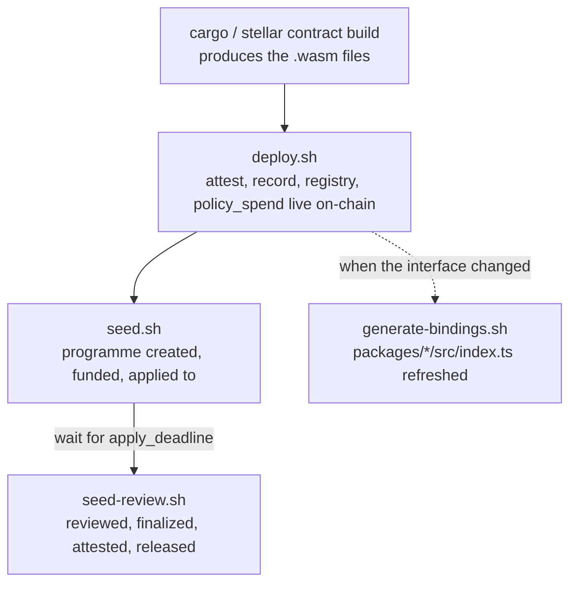

# Deployment runbook

Deploying Milepost to a network is five scripts run in a specific order, with
prerequisites and recovery steps that live in shell comments and the
author's head rather than anywhere a new deployer can find them. This is
that missing document: what to install first, what each step does and why it
must come before the next one, how to tell it worked, and what to do when it
doesn't. It only covers testnet — see [Out of scope](#out-of-scope).

If you just want a working deployment and don't need to inspect state
between steps, skip to [Fast path](#fast-path-quickstartsh). This document is
for when you want to understand or debug what that script is doing for you,
or when a step has failed and you need to know whether it's safe to re-run.

## Prerequisites

| Tool | Version | Why |
| --- | --- | --- |
| Rust + Cargo | stable, per [`rust-toolchain.toml`](../rust-toolchain.toml) | Builds the contracts. The toolchain file pins the `wasm32v1-none` target and `rustfmt`/`clippy` components, so a plain `cargo build` via `rustup` installs them for you — no separate `rustup target add` needed unless you're invoking `rustc` outside `rustup`'s shim. |
| Stellar CLI | 27.x (CI pins `v27.1.0`) | Builds, deploys, invokes, and generates TypeScript bindings. `deploy.sh`, `seed.sh`, and `seed-review.sh` all shell out to it. |
| Python 3 | any recent 3.x | `deploy.sh`, `seed.sh`, and `seed-review.sh` read and write the JSON deployment records with it — there's no jq dependency here. |
| Node.js + npm | 24, npm ≥8 | Only needed for the last, optional step: regenerating `packages/*` and pointing the frontend at your deployment. Skip this if you only need the contracts live. |

You do not need a pre-funded account. `deploy.sh` and `seed.sh` each generate
and fund (via testnet Friendbot) any local Stellar CLI identity that doesn't
already exist. Friendbot only exists on testnet/futurenet — this is one of
the reasons mainnet is out of scope here.

## The dependency chain

The five scripts run in a fixed order because each one depends on state the
previous one created — this is not a style preference:



- **Build precedes deploy** because `registry` doesn't deploy a programme
  contract instance per creation — it instantiates one from an uploaded wasm
  hash. That hash has to exist on-chain before `registry` itself can be
  constructed with it.
- **`record`'s admin starts as the deployer and moves to `registry` last**,
  inside `deploy.sh`, because `registry`'s address doesn't exist until after
  `registry` deploys. That hand-off is what lets `registry` authorise the
  programmes *it* deploys to write standing — a programme deployed any other
  way never gets that authorisation. See the [trust model](../README.md#trust-model).
- **Seeding is split into `seed.sh` and `seed-review.sh`** because the
  scenario's phases are driven by wall-clock deadlines: applications have to
  actually close before review can run, so no script can collapse the two
  without either faking the clock or just waiting.
- **Bindings regeneration is decoupled from deployment.** `generate-bindings.sh`
  reads the ids it bakes into `packages/*/src/index.ts` from the *checked-in*
  `packages/testnet.json`, never from whatever `deploy.sh` just wrote to
  `deployments/<network>.json`. Deploying your own throwaway contract set does
  not, by itself, change what the frontend talks to — see
  [Step 5](#step-5-regenerate-typescript-bindings-conditional).

## Step 1 — Build the contracts

```sh
stellar contract build
```

Run from the repository root. This compiles every contract crate under
`contracts/*` to `target/wasm32v1-none/release/*.wasm`. `crates/types` has no
`cdylib` target and produces no wasm — seeing four contracts' worth of
artifacts plus nothing for `types` is correct, not a partial failure.

**Verify:**

```sh
ls target/wasm32v1-none/release/*.wasm
```

Expect exactly five files: `milepost_attest.wasm`, `milepost_record.wasm`,
`milepost_registry.wasm`, `milepost_program.wasm`,
`milepost_policy_spend.wasm`.

**On failure:** nothing has touched a network yet. Fix the compile error and
re-run; there is no partial state to clean up.

## Step 2 — Deploy the contract set

```sh
./scripts/deploy.sh [network] [source-account]
# e.g. ./scripts/deploy.sh testnet milepost-deployer
```

Both arguments default to `testnet` and `milepost-deployer`. In order, this:

1. Generates and Friendbot-funds the source identity if it doesn't already
   exist locally.
2. Deploys `attest`.
3. Deploys `record` with the deployer as its admin (temporary — see above).
4. Uploads (not deploys) the `program` wasm, since `registry` instantiates
   programmes from this hash rather than from a shared instance.
5. Deploys `policy_spend` — one instance serves every restricted wallet.
6. Deploys `registry`, wired to `attest`, `record`, `policy_spend`, and the
   uploaded programme wasm hash.
7. Hands `record`'s admin to the now-deployed `registry`.
8. Writes every id to `deployments/<network>.json` (gitignored —
   environment-specific, regenerated freely) — **only on full success**. This
   file's presence is itself the signal that the deploy actually completed.

**Verify:**

```sh
cat deployments/testnet.json
```

Confirm `attest`, `record`, `registry`, `policy_spend`, and `program_wasm`
are all populated, then check the registry is live and has deployed nothing
yet:

```sh
stellar contract invoke --id <registry-id> --source-account milepost-deployer \
  --network testnet -- nonce
```

This should print `0` for a freshly deployed registry.

**On failure (partial deployment):** `deploy.sh` has no resume capability —
by design, `deployments/<network>.json` is only written at the very end, so a
failure at any point (a network blip deploying `registry`, an under-funded
deployer, an interrupted `set_admin` call) leaves some number of contracts
already live on-chain with their ids recorded nowhere. On testnet these
orphaned contracts cost nothing and reference nothing; there is no cleanup
step because there is nothing to clean up — just **re-run `deploy.sh` from
the top**. It always deploys a fresh set rather than resuming or upgrading,
which is also why re-running it after a *successful* prior deploy is a
deliberate break, not just a recovery mechanism: every existing consumer of
the old ids (a running frontend, a seeded scenario) stops working and has to
be re-pointed.

If the failure is specifically an under-funded deployer, don't try to
top up the existing identity — pass a new `source-account` name and
`deploy.sh` will generate and Friendbot-fund a fresh one for you:

```sh
./scripts/deploy.sh testnet milepost-deployer-2
```

## Step 3 — Seed a scenario, part one

```sh
./scripts/seed.sh [network]
```

Reads `deployments/<network>.json` (fails immediately with a clear message if
it's missing — see Step 2) and drives a real scenario: registers an
attestation schema, creates a programme with two donors and two applicants
who ask for very different amounts, and writes the result to
`deployments/<network>.seed.json`.

The ten actor identities (`milepost-creator`, `milepost-donor-a`, and so on)
are generated and Friendbot-funded on first run and then reused — they live
in your local Stellar CLI keystore, not in the repo, so they persist across
re-runs of this script.

**Verify:** the script prints the programme address and an application
deadline; `cat deployments/testnet.seed.json` shows the same programme id
plus every actor's address and the four phase deadlines.

**On failure / re-running:** the script's own header calls this safe to
re-run, and it means it literally — every run creates a **new** programme and
schema rather than mutating the last one, so a failure partway (say, the
second `apply` call errors) just leaves an abandoned, harmless programme with
one application in it. Re-run `seed.sh` again; it does not need the previous
attempt cleaned up, and it will not reuse the abandoned programme.

## Step 4 — Seed a scenario, part two

```sh
./scripts/seed-review.sh [network]
```

Requires `deployments/<network>.seed.json` from Step 3, and refuses to run
before the application deadline it recorded has passed — it prints how long
that is and exits rather than doing anything partial:

```
applications close in 214s — wait, then re-run
```

Once applications are closed, this has three reviewers vote on both
applicants (disagreeing 300/100/500 on one, unanimous on the other),
finalizes both awards, has the clinic attest a milestone, releases the first
tranche, and has the recipient direct part of it to a payee.

**Verify:** the script prints a final-state summary (allocation, standing,
total released) ending in the programme address. Cross-check any figure
against the [error code reference](error-code-reference.md) if a read comes
back with an error instead of a number.

**On failure partway:** unlike `seed.sh`, this is not idempotent — it acts on
*the one existing* programme from Step 3, and several of its calls
(`review`, `finalize`, `release`) can only succeed once per applicant. If a
re-run after a partial failure reports an error, check whether the step
already landed before assuming something is broken:

| Error you see on re-run | What it means |
| --- | --- |
| `AlreadyReviewed` | That reviewer's vote from before the failure already landed — move on to the next reviewer or to `finalize`. |
| `AlreadyFinalized` | The award already settled; do not re-run `finalize` for that applicant. |
| `AttestationAlreadyUsed` | The attestation from before the failure already unlocked a tranche. |

The full table is in [`docs/error-code-reference.md`](error-code-reference.md).
If the failure was before any of these calls landed (e.g. a network error on
the very first `review`), it's safe to just re-run the whole script.

## Step 5: Regenerate TypeScript bindings (conditional)

Only needed if a contract's interface changed, or if you want the frontend to
talk to ids other than the ones in the checked-in
[`packages/testnet.json`](../packages/testnet.json). Deploying your own
contract set in Step 2 does **not**, by itself, do either of these things —
the frontend's `@milepost/*` packages carry whatever `networks.testnet` was
last generated against, independent of what you just deployed.

```sh
cargo build --target wasm32v1-none --release   # if not already built
./scripts/generate-bindings.sh
```

This regenerates `packages/*/src/index.ts` from the built wasm, then restores
each singleton's (`attest`, `record`, `registry`, `policy_spend`) baked-in
`networks.testnet` address from `packages/testnet.json` — **not** from
`deployments/<network>.json`. `program` gets no baked address, because every
programme is its own contract instance.

**To point the frontend at ids you just deployed yourself** (rather than the
shared testnet set), edit `packages/testnet.json` with your new ids first,
then run `generate-bindings.sh`. Do this deliberately — it's a shared file,
and changing it repoints every other consumer of the "canonical" testnet
deployment, not just your local frontend.

**Verify:**

```sh
./scripts/check-bindings.sh
```

Fails loudly, with the exact regenerate command, if the committed bindings
don't match the built wasm's interface — this is also what CI runs on every
PR. It separately checks that all four singletons still carry a `networks`
block at all, because a naive `stellar contract bindings typescript --wasm
... --overwrite` run directly against `packages/` (instead of through
`generate-bindings.sh`) silently drops it, which has broken the frontend's
ability to reach the registry before.

**On failure:** `check-bindings.sh` tells you exactly what's wrong — either
"drift" (the committed file doesn't match the interface the wasm actually
has; regenerate) or a missing `networks` block (restore it from git history,
or regenerate correctly). There's no partial state here worth worrying about;
both scripts are safe to re-run.

## Fast path: quickstart.sh

```sh
./scripts/quickstart.sh [network] [source-account]
```

Runs Steps 1–4 above end to end: checks the `stellar` CLI, `rustup`, the
`wasm32v1-none` target, and `python3` are present up front and fails fast
with install instructions if not; builds; deploys; seeds; shows a live
countdown while it waits out the application window; runs the review stage;
and prints a summary of the programme address, the awards reviewers settled
on, and what was released.

It does not run Step 5 — regenerate bindings separately if you need the
frontend pointed at what it deployed. If any wrapped step fails, the same
recovery guidance above applies; `quickstart.sh` does not add its own retry
logic beyond the dependency checks at the start and the wait between seeding
and review.

## Out of scope

- **Mainnet.** Every script above defaults to and is written for testnet.
  Nothing here Friendbot-funds a mainnet account (there is no Friendbot on
  mainnet), and a mainnet deployment carries real-money consequences this
  runbook does not address.
- **Automating the deployment further**, or **replacing these scripts**. This
  document explains what they already do; it isn't a proposal to script the
  scripts.
- **Recovering already-archived Soroban ledger entries** — see
  [`docs/ttl-strategy.md`](ttl-strategy.md) for that concern, which is
  unrelated to deployment failures.
